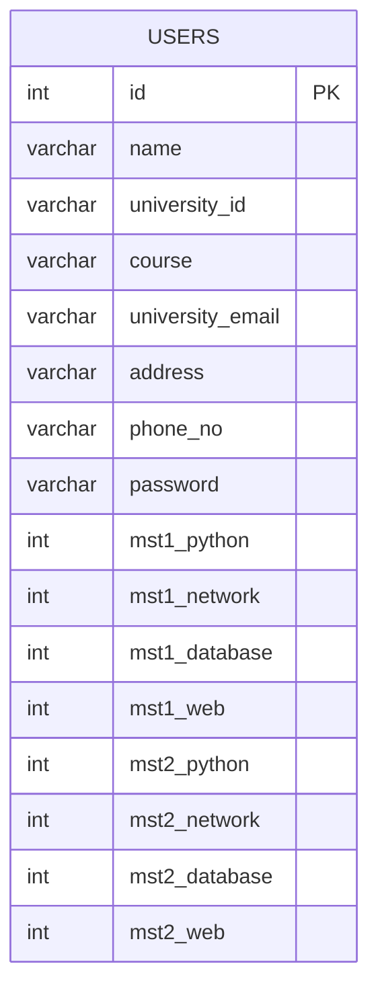
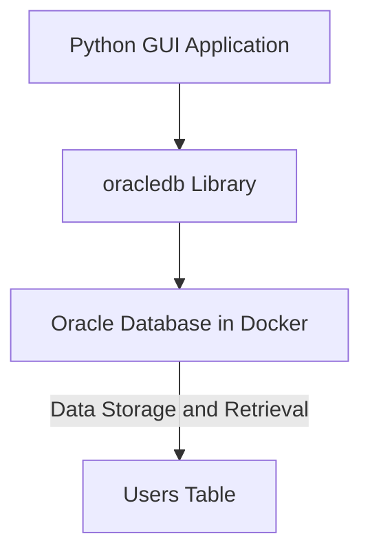

# **User Management System**
> **University Project for PL/SQL Lab**

---

## **Table of Contents**
1. [Introduction](#introduction)
2. [Project Setup](#project-setup)
3. [Database Schema](#database-schema)
4. [Application Features](#application-features)
5. [Database Connection Architecture](#database-connection-architecture)
6. [Running the Application](#running-the-application)
7. [Future Enhancements](#future-enhancements)

---

## **1. Introduction**

The **User Management System** is a GUI-based application built for managing user profiles and MST (Mid-Semester Test) marks. This project fulfills the requirements of the PL/SQL Lab subject by leveraging Oracle SQL in a Docker container, allowing for smooth data management and user authentication.

### **Purpose & Objectives**
- **Sign-Up and Login**: New users can register, and existing users can log in with a unique University ID and password.
- **User Profile Management**: Users can update their details, and view and compare MST marks in a visual format.
- **Data Storage**: Information is stored in a secure, centralized Oracle database, ensuring data persistence and easy retrieval.

---

## **2. Project Setup**

The project consists of two main components:

2. **Python GUI Application**: A modern, interactive interface for user interactions.


- **Host**: `localhost`
- **Port**: `1521`
- **Service Name**: `XEPDB1`
- **Username**: `system`
- **Password**: `YourStrongPassword`

### **Python Application Requirements**

1. Install the following Python libraries:

   ```bash
   pip install customtkinter matplotlib oracledb
   ```

---

## **3. Database Schema**

The database schema is structured to manage both user profiles and MST marks. Here’s the SQL schema used to create the `users` table:

```sql
CREATE TABLE users (
    id                  NUMBER GENERATED BY DEFAULT AS IDENTITY PRIMARY KEY,
    name                VARCHAR2(50) NOT NULL,
    university_id       VARCHAR2(15) UNIQUE NOT NULL,
    course              VARCHAR2(50) NOT NULL,
    university_email    VARCHAR2(100) NOT NULL,
    address             VARCHAR2(150),
    phone_no            VARCHAR2(15),
    password            VARCHAR2(50) NOT NULL,

    -- MST 1 Marks
    mst1_python         NUMBER(2) DEFAULT 0 CHECK (mst1_python BETWEEN 0 AND 20),
    mst1_network        NUMBER(2) DEFAULT 0 CHECK (mst1_network BETWEEN 0 AND 20),
    mst1_database       NUMBER(2) DEFAULT 0 CHECK (mst1_database BETWEEN 0 AND 20),
    mst1_web            NUMBER(2) DEFAULT 0 CHECK (mst1_web BETWEEN 0 AND 20),

    -- MST 2 Marks
    mst2_python         NUMBER(2) DEFAULT 0 CHECK (mst2_python BETWEEN 0 AND 20),
    mst2_network        NUMBER(2) DEFAULT 0 CHECK (mst2_network BETWEEN 0 AND 20),
    mst2_database       NUMBER(2) DEFAULT 0 CHECK (mst2_database BETWEEN 0 AND 20),
    mst2_web            NUMBER(2) DEFAULT 0 CHECK (mst2_web BETWEEN 0 AND 20)
);
```

### **Schema Diagram**



---

## **4. Application Features**

### **Signup and Login**
- **Sign-Up**: New users can register by providing essential information.
- **Login**: Existing users can access their dashboard by entering their University ID and password.

### **Dashboard**
- **User Profile**: Displays user details (e.g., Name, Course, Email, Address, Phone Number).
- **MST Marks Comparison**: Allows users to enter and compare their MST 1 and MST 2 marks for multiple subjects in a graphical format.
- **Edit Profile**: Users can update their information at any time.
- **Logout and Delete Account**: Options for securely logging out or deleting the account entirely.

### **Graphical Comparison**
- **Bar Graph Visualization**: Compares MST 1 and MST 2 marks, making it easy for users to see their progress.

---

## **5. Database Connection Architecture**

The connection between the application and the database uses the `oracledb` Python library, allowing for efficient data retrieval and storage.

### **Architecture Diagram**



---

## **6. Running the Application**

### **Start the Oracle Database in Docker**

Make sure the Docker container is running:

```bash
sudo docker start oracle-xe-21c
```

### **Run the Python Application**

To launch the application, execute the following command:

```bash
python main.py
```

### **Usage Walkthrough**

1. **Sign-Up**: Enter personal details to create a new user account.
2. **Login**: Use University ID and password to access the dashboard.
3. **View and Edit Profile**: Check and update personal information.
4. **Enter MST Marks**: Provide MST 1 and MST 2 marks for each subject. The dashboard will display a comparison graph.

---

## **7. Future Enhancements**

- **Expanded Subject List**: Add more subjects for MST marks entry.
- **Enhanced Analytics**: Provide more insights on dashboard analytics.
- **Role-Based Access Control**: Introduce admin features for managing user accounts.

---
